# Guided Lab: Intro to Wireshark

## Introduction

Welcome to this First guided lab, today we will be talking about a pretty known network protocol analyzer, called **wireshark** and see how we can benifit from it from a hacking perspective

Follow along and try to hack the system !

## Description

> Wireshark is a free packet analyzer. It is used in computer network troubleshooting and analysis, protocol development, education and reverse engineering.

## Instructions

### Installation and Opening

For Linux users, first make sure your system is up to date:

```sh
sudo apt update
```

Then, make sure to install `wireshark` along with its command line `tshark`:

```sh
sudo apt install wireshark
sudo apt install tshark
```

At the end of the installation, you can open the software by running:

```sh
wireshark
```

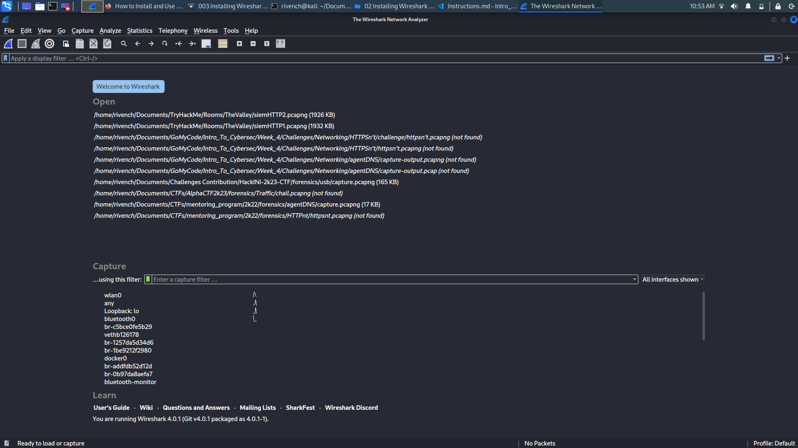

you can also verify the installation of the command line with the following command:

```sh
tshark -v
```

**Note:** For Windows users, all you have to do is to download and execute the wireshark installer.

### Software Discovery

After opening the wireshark interface, you can see some information displayed:

- **Latest Captures:** latested opened, created captures, you can still check them out or open new ones:
- **Capture:** where wireshark is recording the behavior of your computer interfaces. We will see later the purposes of the `filter` bar after making some captues.


### Start The Capture

At the top left of the interface, you can find the `start` button in order to start capturing packets. Make sure you specify the interface you want to capture.

Similarly, you can launch the capture process from the terminal using this command:

```sh
wireshark -i wlan0 -k
```

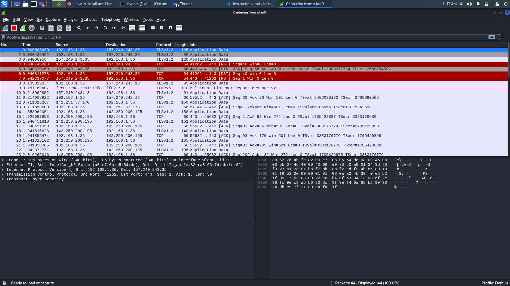

or by typing the command line:

```
tshark
```

At the end of the capturing process, you can still save the results in a `.pcapng` file.

**Note:** For the `tshark` command line, it is preferable to specify directly the interface and output `.pcapng` file to save in your work:

```
tshark -i wlan0 -w capture-output.pcap
```

### Reading a Capture

In order for you read a recent capture, you can either open wireshark and specify the capture you want to read, or type in the command line:

```
wireshark capture-output.pcap
```

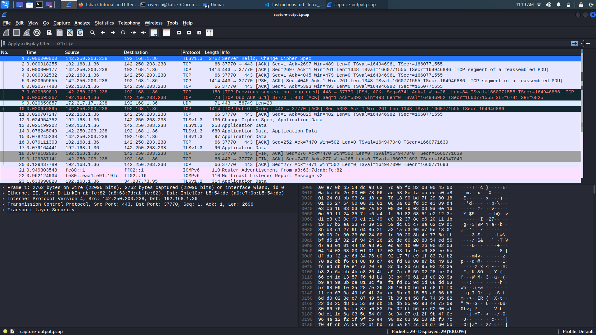

Similarly, using the command line:

```sh
tshark -r capture-output.pcap
```

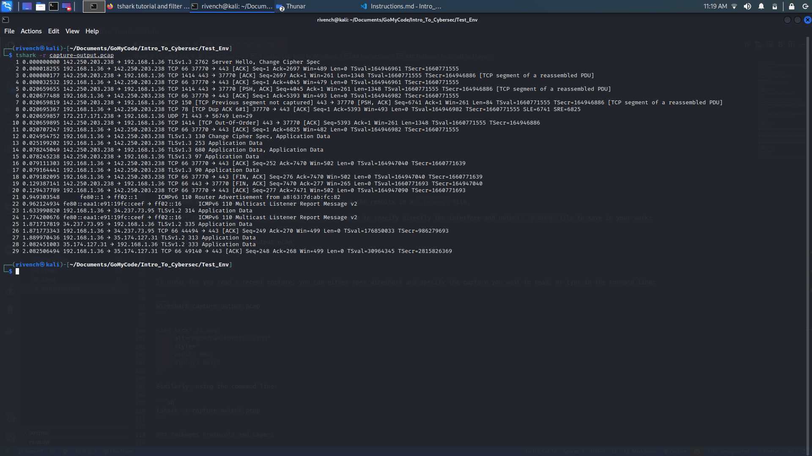

#### Question 1: What's the difference between `wireshark` and `tshark` ?

#### Task 1

Using the wireshark tool, launch your first capture and save it in a `text.pcapng` file.

### Packets Protocols and Layers

From a Networking perspective, and as we discovered before the **OSI Model**, wireshark will be responsible on capturing data and communication from **Transport Layer** and **Application Layer**.

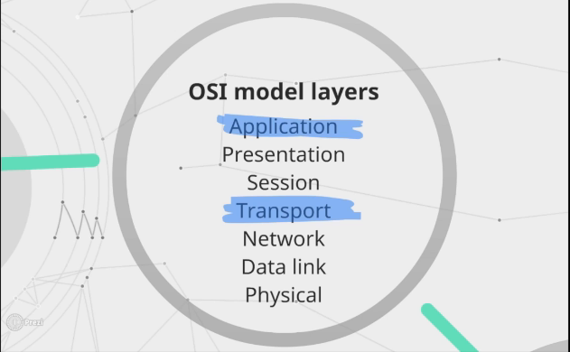

To have a more understanding on what type of data and what is actually displayed in the interface, let's dive deeper into it.

The wireshark interface is mainly composed from two layuts:

- **Packets List:** where you will be displayed a set of packets, each packet have:
  - **Source**
  - **Destination**
  - **Protocol**
  - **Information Summary**

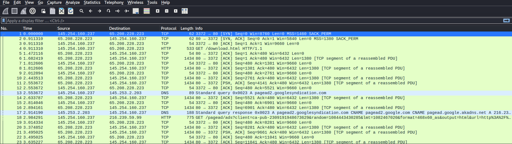

As security Analysts, our job is to look for packets that have some known protocols like `HTTP`, `DNS`, `FTP`...

As you choose the packet you want to analyse, you will be confronted with the second layout:

- **Packet Details:** where for each layer of the TCP model, and depending on whatever it is a Transport Layer Protocol (TCP) or an Application Layer Protocol (HTTP, HTTPS, DNS ...), a set of flags and information are displayed:

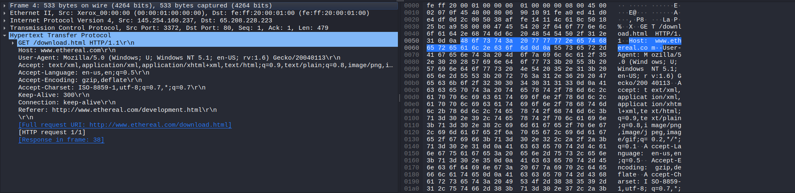

Follow along with your instructor for the exploration of the Packet Details Section.

### Capturing and Filtering

Now that you have mastered recording packets from your network interface, it seems obvious that the network handles a large amout of packets each second. In order to process them well, some filtering is required.

Let's say you have [netlink.pcap](captures/netlink.pcap), and you want to check the DNS records packets in this capture. To do that:

- Open the capture using wireshark
- In the filter bar, specify the `dns` key word
- Hit `Enter` and see how the dns packets will be displayed:

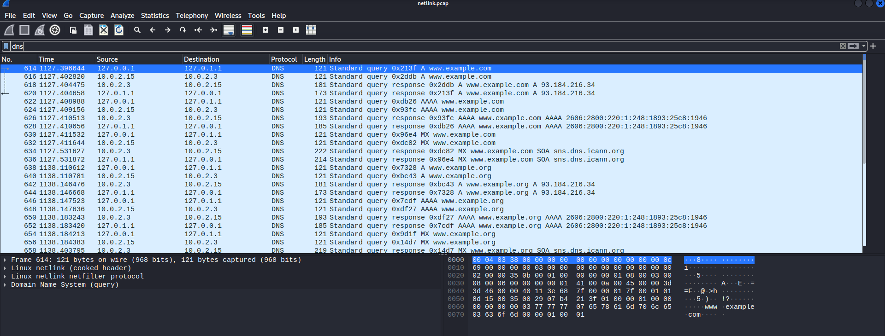

Let's say you can to go deeper in the analysis and check packets that queries the `www.example.com` hostname, you can do that by adding another filter to your quest as follow:

```
dns && dns.qry.name=="www.example.com"
```

Note the usage of connectors:

- `&&`: AND connect, as you want to take packets that have same properties only.
- `||`: OR connector, as you want to take the packets that have one of the listed properties.

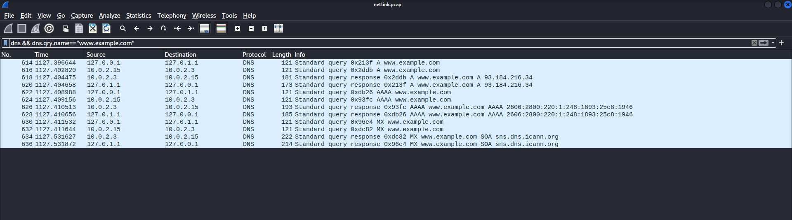

You can also filter as you are capturing using the `tshark` command. For example in order to filter the `ssh` traffic which runs on the port `22`, we can do as follow:

- Launch the capture on the specific interface and specify the port:

```
tshark -i lo -n -p -f 'port 22'
```

- Connect to the desired machine using the `ssh` protocol:

```
ssh rivench@localhost 
```

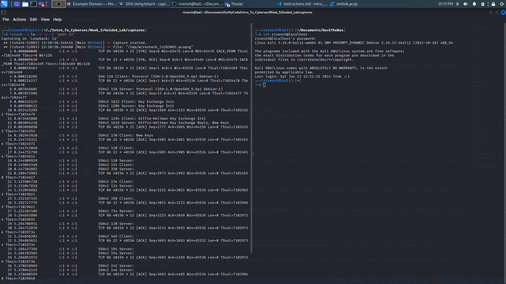

Further more, to show the data content, add the `-x` option:

```
tshark -i lo -n -p -f 'port 22' -x
```

#### Task 2

- Using the `tshark` command line, launch a capture to target only http requests to the `www.example.com` hostname, and same the result in a `output.pcap` file.
- After that, open the capture using the `wireshark` interface.

### Following data streams

Lets say you have visited a website where you can reconstruct the website by following the tcp/http stream. After capturing the data, you will find yourself with the following caputre [http.cap](captures/http.cap).

From there:

- Open the http.cap file
- Set up the filter to only show http traffic ( this is optional, it just help us to learn the filter)
- In order to check one of the packets content, you can either have a look in the **Packet Details** Section, or by right clicking on the packet and go in `follow`, then `http stream`

Now we can see the whole html code, with this information we can reconstruct the whole website. In order scenarios, you can also find other types of data like **Pictures** or even **Form Data**.

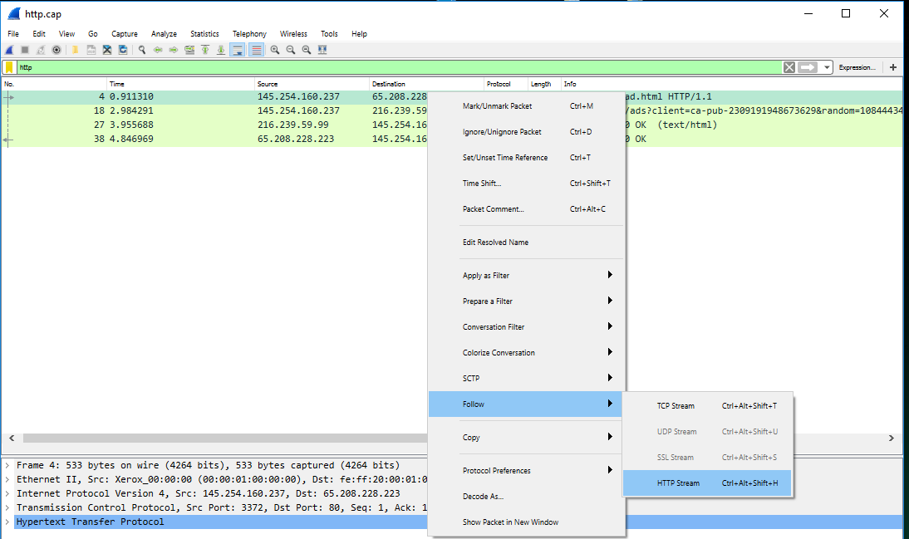

### Exporting Files

It is very simple to save data from an unencrypted website as well. To do that :

- Let's open the http_with_jpegs.cap.gz file
- Open Export Objects, HTTP, 
- Choose to Save a file or Save All

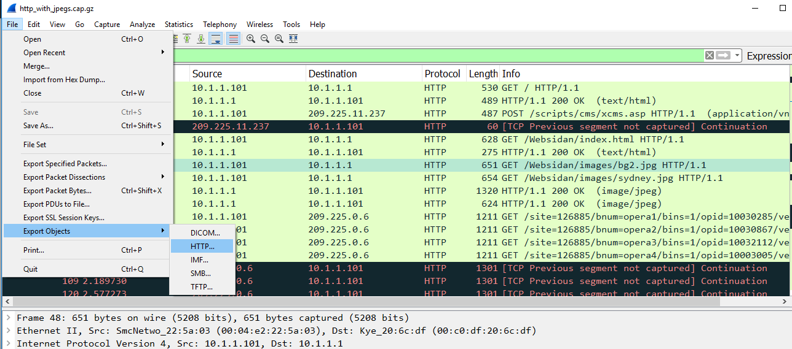

## More Information

- PCAP Samples: https://wiki.wireshark.org/SampleCaptures#sample-captures
- Wireshark Tutorials with commands:
  - https://hackertarget.com/tshark-tutorial-and-filter-examples/
  - https://unit42.paloaltonetworks.com/using-wireshark-exporting-objects-from-a-pcap/
- Some TryHackMe Rooms to check:
  - https://tryhackme.com/room/whatisnetworking
  - https://tryhackme.com/room/introtolan
  - https://tryhackme.com/room/introtonetworking
  - https://tryhackme.com/room/dnsindetail
